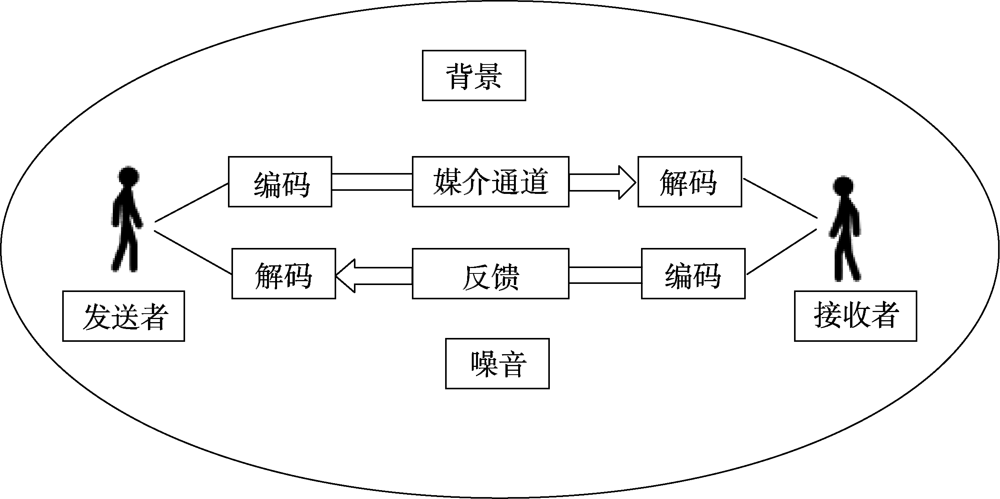
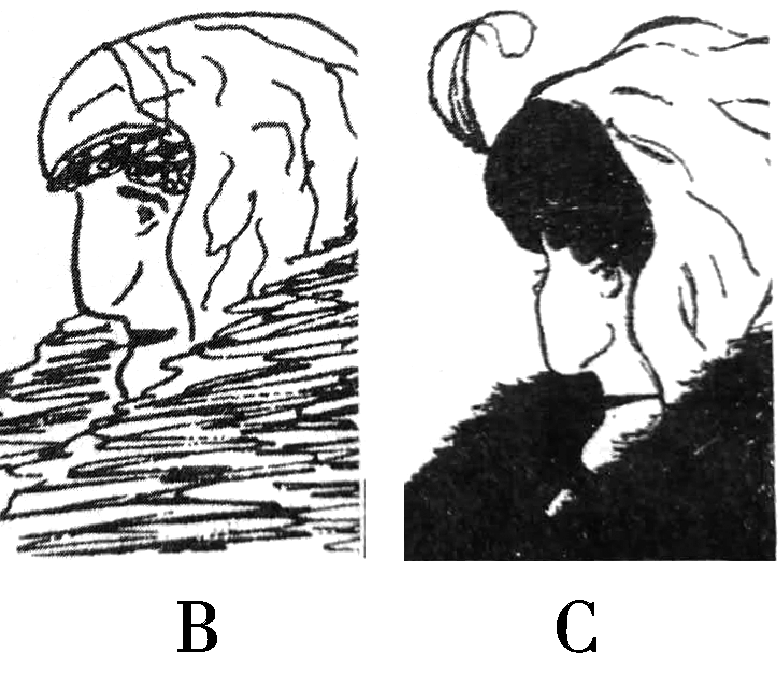
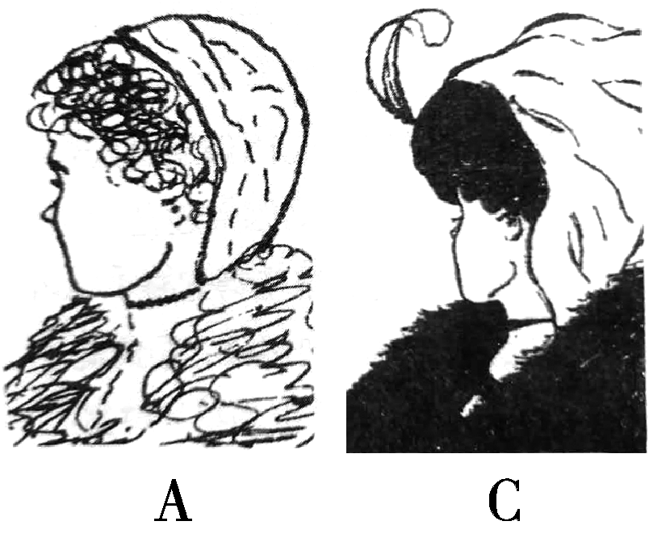

# 老年人沟通技能指导手册

> **图书特色**
>
> - 1.贯彻落实“思政教育进课堂”
> - 2.强化“教学做一体”的职教特色
> - 3.重产教融合、校企合作开发
> - 4.注重实践教育、体验教育和养成教育

---

## 目录

- 项目1 沟通技巧的基础 p5
  - 任务1 了解沟通的概念与要素 p5
    - 学习目标 p5
    - 任务描述 p5
    - 知识学习 p6
      - 一、沟通的含义与要素 p6
      - 二、沟通的过程 p7
      - 三、沟通的影响因素 p7
    - 实训演练 p9
    - 课后练习 p9
      - 一、填空题 p9
      - 二、选择题 p10
      - 三、判断题 p10
      - 四、案例练习 p10
      - 五、实训演练 p11
  - 任务2 了解沟通的层次与类型 p12
    - 学习目标 p12
    - 任务描述 p12
    - 知识学习 p12
      - 一、沟通的层次 p12
      - 二、沟通的类型 p13
    - 实训演练 p14
    - 课后练习 p15
      - 一、填空题 p15
      - 二、选择题 p15
      - 三、判断题 p16
      - 四、案例练习 p16
      - 五、实训演练 p16
  - 任务3 练习语言沟通与非语言沟通 p17
    - 学习目标 p17
    - 任务描述 p17
    - 知识学习 p18
      - 一、语言沟通和非语言沟通 p18
      - 二、老年人服务中的语言沟通 p18
      - 三、老年人服务中的非语言沟通 p19
    - 实训演练 p21
    - 课后练习 p24
      - 一、填空题 p24
      - 二、选择题 p24
      - 三、判断题 p24
      - 四、实训演练 p24
  - 任务4 心理效应对沟通的影响 p25
    - 学习目标 p25
    - 任务描述 p25
    - 知识学习 p26
      - 一、首因效应 p26
      - 二、近因效应 p27
      - 三、晕轮效应 p28
      - 四、刻板效应 p29
    - 实训演练 p30
    - 课后练习 p30
      - 一、填空题 p30
      - 二、选择题(选择一个正确答案,并将相应字母填入题内的括号中) p30
      - 三、判断题(将判断结果填入括号中,正确的填“”,错误的填“✕”) p31
      - 四、案例练习 p31

---

本教材的内容设计将理论与应用结合：根据工作岗位的实际需求，采取“任务式”学习，让学生在掌握理论的基础上以学促练、以练备用、以用促学。本教材的内容架构按照不同特点的老年人群分项目进行：前两个项目从沟通技巧的基础及应用入手，使学生掌握沟通的基本理论与技能。项目三引入老年人的身心特点及初次会谈的内容，使学生了解老年人群的生理、心理特点，掌握与老年人群沟通的基本技能。项目四、五、六则分别从老年人的身体、心理、行为、人际等方面设置不同模块进行学习与练习。为了让本教材更具实用性，每一项任务都安排了案例实操，理论内容聚焦于为实操服务。本书不仅可作为教材以供教育工作者教授相关课程，亦可被用作与老年人沟通的“手册”或“指南”，在阅读的过程中，习得更多的方法和技巧。

## 项目1 沟通技巧的基础

### 任务1 了解沟通的概念与要素

#### 学习目标

**知识目标**

- 识记沟通的内涵
- 掌握沟通过程的要素

**能力目标**

- 会辨识沟通中的影响因素
- 能够采用策略减少沟通噪音
- 能够有效且适当地进行沟通

**素质目标**

- 形成主动沟通的意识

#### 任务描述

奇奇和怪怪是养老专业二年级学生，班主任金老师把他俩叫到办公室说：“你们两个去一趟恒康养老院，对接一下本学期的实习安排。”“好嘞！”两人听说要去实习，心中大喜，拔腿就往外跑。两年所学终于有了用武之地，可能是太高兴了吧，他俩并没有看到金老师冲着他们的背影神秘地笑了。

果然，刚关上老师办公室的门，两个人就傻眼了。奇奇问： “咱俩怎么去呀？老师给不给出行经费呀？”怪怪说：“对噢，到恒康养老院后咱俩找谁对接这个事情呢？”奇奇一拍脑袋：“咱俩莫不是走下荧屏的‘没头脑’吧，哈哈。”

两个人打算再向老师问一些细节，又敲门道：

“报告老师，我们想问问……”料定他俩会返回，金老师笑着说： “沟通是人际互动的基本技能，有效的人际沟通包括哪些要素呢？你俩可要想好啦，把需要的信息一次性跟我沟通全。”问题讨论：同学们，快来帮助奇奇和怪怪拟定沟通计划书吧。

#### 知识学习

##### 一、沟通的含义与要素

沟通是由内在心理需求或外在社会刺激引起的交互性社会行为，是行为主体之间通过各种载体实现信息流动、产生相互影响、达到特定目标的行为过程。沟通过程包括四个要素，即：沟通主体、沟通内容、沟通载体和沟通环境。

1.沟通主体

沟通主体指参与沟通行为的个人或团体，是信息的发送者与接收者。发送者与接收者的身份可以根据需要互相转换。

2.沟通内容

沟通内容指主体之间进行沟通的信息。不同的应用领域对沟通内容有不同的分类标准。比如，用于沟通的信息可以是知识、技能、方法、策略，或者是政策、法规、规定、条文、新闻、评论、消息、观点、想法、情感，等等。

3.沟通载体

沟通载体指沟通信息的承载物，是信息传递的媒介或手段。最常用的沟通载体是语言，包括口头沟通和书面语言。非言语的气味、动作、表情、声音或身体姿势也可以作为沟通信息的载体。印刷品、音像制品、无线电、广播、电话、手机、电视、电影、电脑、网络和社交软件等大众媒介均可成为沟通载体。

4.沟通环境

沟通环境指沟通行为所发生的物理空间及其中可以直接或间接影响沟通行为的各种因素。包括：物理环境，人文环境和心理环境。

物理环境是客观存在的物理空间与自然因素的总和，如沟通的地点与场所等。人文环境指沟通主体的文化背景与社会背景，如历史传统、宗教信仰和风俗习惯等。心理环境是指一个人的认知特点、思维模式、情绪情感、意志品质、行为习惯、性格特点、人格类型、兴趣爱好、需要、动机与目标等。

##### 二、沟通的过程

首先，发送者编码并发送信息。发送和传递的信息可能是观点、想法或资料，因此，发送者需要把所要发送的信息进行编码，转译成接收者能够理解的一系列符号(比如图片、文字或语言等)，通过一定的渠道和载体将信息传递出去。

其次，信息的接收者通过相应的方式接收信息后，进行解码并转化为主观的理解，针对之前接收的信息向发送者做出反应和反馈，或者发送新的信息给对方，原来的发送者可能因此成为信息的接收者，通过反馈回来的信息，了解其传递的信息是否被对方准确地接收，进而开展后续沟通。

图1-1-1 沟通要素及过程

##### 三、沟通的影响因素

1.沟通主体

沟通主体之间的差异性是影响沟通效果的重要因素。受生理功能、表达能力、知识结构或文化差异等诸多因素的影响，沟通主体的编码能力、编码方式与解码能力均具有客观的差异性，因此，信息的传递者与接收者的编码与解码方式越接近，信息越能够被真实、无损、有效地传递，可以从沟通主体的文化背景、心理背景和社会背景等方面考虑沟通主体之间的差异性。

2.沟通媒介

媒介与信息的匹配性直接影响沟通效果。根据沟通主体及沟通信息的特质选择与之匹配的沟通媒介可以提升沟通的效果。一个沟通过程，可能使用多种沟通媒介与沟通渠道，比如，面对面交流时，既有口头语言的参与，也有身体语言的影响。与有听力障碍的老人沟通时，可能既出示文字卡片，也辅以语言沟通。

3.反馈

沟通过程必须依赖于有效、及时的反馈，没有反馈的沟通过程容易出现沟通失误或沟通失败。值得注意的是：反馈并非总是自觉发生的，也不是可以一次性完成的，信息的反馈可能透过表情、语气、体态和下意识的行为等信息被对方捕获。

4.沟通环境

人际沟通受环境因素的影响与制约，此影响因素囊括了现实情境及对人发生影响的一切过去、如今和将来的人、事、物等全部社会存在。因此，沟通环境的影响总是同时在客观与主观两个层面起作用。

5.沟通噪音

一切影响沟通的消极因素都可以称为沟通噪音。沟通噪音存在于沟通过程的各个环节，造成信息沟通的失误、失真或失败。按照沟通要素可以将沟通噪音分为以下几种：发送与接收噪音、传输噪音、环境噪音等。

(1)发送与接收噪音

发送与接收噪音来自发送者与接收者。主要有两种情况：一是来自信息发送者的编码噪音，比如，编码错误、编码能力不佳、逻辑混乱、发送方式误差等造成的信息编码与发送失误；二是受信息接收者的接收能力、理解能力与经验等因素的影响，而造成的不能准确把握和理解信息的内涵。

(2)传输噪音

传输噪音发生在信息的传递过程中。由于通道的匹配性、质量和稳定性，导致发送的信息减损或遗失。比如，信件和文件在传递过程中损坏或丢失，或者在信息传递过程中被重新编排和改造。传输噪音也可能来源于设备与技术水平的有限性，所传递的信息量太大或严重不足，没有进行足够的反馈与校验等。

(3)环境噪音

来自沟通情境中的噪声统称为环境噪音。沟通过程中的文化背景、心理背景、社会背景与物理环境等均可以造成对沟通效果的干扰。

受文化影响，跨文化交流时要注意文化的差异性。受个人兴趣、情绪、愿望等心理因素的影响，可能造成对信息的主观增删，影响信息的完整性、准确性或及时性。受社会背景的影响，可能因为价值判断产生沟通误差。物理环境的气氛、光线、噪音等也会对沟通主体造成一定的影响，比如，红色让人感觉烦躁，蓝色让人平静，人在温馨的氛围中容易忘记时间，在阴冷的氛围中则觉得度日如年。

#### 实训演练

为奇奇和怪怪拟定沟通计划书并进行以下情景演练：

1.任务准备阶段：与班主任老师进行任务目标与计划的沟通。

2.任务实施阶段：与养老机构领导进行任务推进与落实的沟通。

3.任务完成阶段：向班主任老师就任务的完成情况进行沟通。

#### 课后练习

##### 一、填空题

1.沟通主体指参与沟通行为的个人或团体，是信息的发送者与 ____。

2.沟通内容指主体之间进行沟通的信息，请列举三项沟通内容： ____ ____ ____

3.沟通载体指沟通信息的承载物，是信息传递的媒介或手段。请列举三种沟

通载体： ____ ____ ____

4.沟通环境指沟通行为所发生的物理空间及其中可以直接或间接影响沟通行为的各种因素。包括：物理环境，和心理环境。 ____

5.一切影响沟通的消极因素都可以称为

##### 二、选择题

6.沟通过程的要素包括（）。

- **A.** 沟通主体
- **B.** 沟通内容
- **C.** 沟通载体
- **D.** 沟通环境

7.以下属于社会环境的是（）。

- **A.** 社会角色
- **B.** 历史传统
- **C.** 宗教信仰
- **D.** 风俗习惯

8.沟通的影响因素有（）。

- **A.** 沟通主体
- **B.** 沟通媒介
- **C.** 反馈
- **D.** 沟通环境

9.可以有效避免沟通漏斗的方法有（）。

- **A.** 写沟通纲要
- **B.** 学习信息的编码技巧
- **C.** 对信息进行反馈
- **D.** 记笔记

##### 三、判断题

10.沟通是由社会刺激引起的，是一种交互性的社会行为。()

11.沟通过程中，发送者与接收者的身份可以互相转换。()

12.语言是一种重要的沟通载体，包括口头语言和身体姿势。()

13.手机、电视、电影、电脑、网络、社交软件属于沟通载体。()

14.宗教信仰、认知特点、思维模式、情绪情感均属于心理环境。()

15.在编码或解码过程中，个人兴趣、情绪、愿望等的影响属于环境噪音。()

##### 四、案例练习

反思与班主任和养老院负责人的沟通过程，将沟通要素整理在下表中。

第一个沟通过程(与班主任)

| 发送者 | 信息 | 媒介 | 接收者 | 如何避免沟通噪音 |
| --- | --- | --- | --- | --- |
|  |  |  |  |  |

第二个沟通过程(与养老院负责人)

| 发送者 | 信息 | 媒介 | 接收者 | 如何避免沟通噪音 |
| --- | --- | --- | --- | --- |
|  |  |  |  |  |

第三个沟通过程(向班主任回馈)

| 发送者 | 信息 | 媒介 | 接收者 | 如何避免沟通噪音 |
| --- | --- | --- | --- | --- |
|  |  |  |  |  |

##### 五、实训演练

李爷爷治疗心脏病的药快用完了，他告诉怪怪： “你跟我女儿说，过几天来看我时带点药。”怪怪白天没联络上李爷爷的女儿，把这件事交接给了值晚班的奇奇：“你给李爷爷的女儿打电话，让她来的时候带治疗心脏病的药。”不巧的是，这个电话是李爷爷7岁的小外孙接的，奇奇告诉他： “让妈妈来养老院的时候给姥爷买点治心脏病的药。”因为担心小家伙忘了，奇奇特意叮嘱说：“你现在赶紧去告诉妈妈，不要耽误事儿。”小家伙赶紧跑到厨房告诉妈妈：“妈妈，养老院来电话了，让你赶紧去给姥爷买治疗心脏病的药，不要耽误事儿。”

李爷爷的女儿赶紧下楼买药，打车直奔养老院。虽然虚惊一场，但她仍感觉愤怒：“你们是如何做工作的？养老院的管理太混乱了，害我白跑一趟。”奇奇委屈地说：“您看李爷爷这不是没事儿吗？白跑一趟总比爷爷真的有事儿强吧。”李爷爷的女儿觉得奇奇没有向自己道歉，还强词夺理，更加愤怒，向主任投诉了奇奇的工作失误。

请思考：是什么导致了沟通失误？以AB剧的方式模拟沟通失误及有效沟通的情境。

### 任务2 了解沟通的层次与类型

#### 学习目标

**知识目标**

- 识记沟通的层次
- 理解沟通的类型特点

**能力目标**

- 会熟练使用不同的沟通类型完成沟通活动
- 能够理解并掌握约翰·鲍威尔(JohnPowell)的沟通层次，进
- 行深入、有效的沟通

**素质目标**

- 形成“为人服务，以人为本”的沟通素养

#### 任务描述

奇奇正在操场跑步，怪怪满头大汗地来找他： “你怎么跑这儿来啦，跟你说了放学后5:30去见金老师向她汇报恒康养老院的实习安排，你这人也真是……”奇奇莫名其妙地被责备也很生气： “你什么时候跟我说了要去见金老师？”

怪怪：“我给你发了微信呀，时间、地点、事件，我可是写得清清楚楚。”

奇奇：“你什么时候给我发微信了？我又没有带手机，怎么看见？”问题讨论：这个误会可是大了，他俩这么吵下去，也吵不出什么名堂

来，同学们，是什么使奇奇和怪怪沟而不通呢？如何应用沟

通技巧使两者的沟通更有效呢？

#### 知识学习

##### 一、沟通的层次

信息交换与情感表达涉及发送与接收过程中的诸多要素。根据沟通效果是否达成，可以把沟通分为四个层次，即：不沟不通，沟而不通，沟而能通，不沟而通。

1.不沟不通

虽然沟通是人的本能需要，但是不沟通也是人际交往中一种常见状态。不沟不通指双方没有沟通的愿望或需要，因此，不进行沟通。《老子》八十一章有：“邻国相望，鸡犬之声相闻，民至老死不相往来。”形象地描述了没有沟通需求的人际关系模式。

2.沟而不通

有沟通意愿与沟通行为，却因沟通过程受阻致使沟通目标不能很好地达成，我们称这种状态为沟而不通。沟而不通是常见的沟通现象，需要分别从编码、解码、沟通噪音等多方面入手，针对问题提出解决方案，便可以使沟通效果得以改善。

3.沟而能通

沟而能通是人们所期望的效果，人际沟通总是以“沟而能通”为目标的。“沟而能通”也受到沟通能力与技巧的影响，需要沟通双方付出时间、心智、情感等多方面努力，在不断交互的渐进过程中获得理解。“沟而能通”不仅是社会层面的信息传递，还给沟通双方带来心理层面的成就感与愉悦感。

4.不沟而通

不沟而通是一种沟通艺术，受沟通双方的默契程度所影响。销售人员总是能够及时把握顾客的心理，长期对“失智老人”进行照顾的社工通常能够更准确地理解老人的生理或心理需求。可以通过练习提升沟通能力，达到“不沟而通”的境界。比如，密切关注对方，关心并注意对方的一举一动，关注语言表达之外非语言的信息。

##### 二、沟通的类型

1.根据沟通氛围分为： 正式沟通和非正式沟通

正式沟通比较严谨，对沟通主体与信息有较强的约束力，比如，企业或团体发送的公函、合同，组织的报告会、发布会等。非正式沟通形式比较活泼，信息容易失真，比如，闲谈、问候、八卦聊天等。

2.根据沟通方向分为： 平行沟通、垂直沟通和轮式沟通

沟通方向主要考虑沟通双方的职位特征。平等沟通常见于平等的组织、部门、成员之间，比如，谈判、协商等；垂直沟通则可以分为下级向上级的上行沟通及上级对下级的下行沟通，多见于工作汇报、问题反馈、提出申请或工作布置、任务分派、工作检查等形式；轮式沟通则是在复杂的沟通网络中进行沟通与互动，比如，多边会谈。

3.根据沟通主体的参与度分为： 单向沟通和双向沟通

单向沟通强调了信息发送或接收的某一方，比如，只发送信息不需要回馈的报告会、就职离职演讲、政策发布等。双向沟通则更强调信息的反馈与沟通主体之间的互动，比如，讨论会、洽谈与交流等。

4.根据信息传递的方式分为： 直接沟通和间接沟通

直接沟通，信息只在两方进行传递，不需要借助第三方。间接沟通则需要第三方的介入，比如两个语言不通的人，需要借助翻译进行间接沟通。直接沟通方便收集第一手材料，并根据沟通的需要进一步推进，比如对老年人的家访、疾病询问、面谈等，但是如果老年人说方言，那么最好能够有一个懂方言的人进行帮助，以便降低沟通不畅造成的误解。

5.根据沟通媒介分为： 口头沟通和书面沟通

口头沟通以语言为媒介，拥有便捷、及时的特点，是人际沟通中最常用的方式。书面沟通以文字为媒介，如信件、备忘录、通知书、法院传票等，这一沟通方式便于信息存储与再现。

#### 实训演练

1.帮助奇奇和怪怪完成向金老师汇报的任务。

(1)奇奇为什么错过了与金老师的约定？

(2)如何能够做到“沟而能通”？

(3)如何进一步向金老师解释，并完成向金老师汇报的任务？

2.为金老师拟一份实习安排通知。

(1)通知的内容包括哪些？

(2)以什么方式发放通知？

#### 课后练习

##### 一、填空题

1.听觉缺失、失语老人的沟通需要采用

的形式。

2.沟通的层次可以分为：不沟不通， ____ ____。最高 ____

层次的是

3.约翰·鲍威尔认为沟通过程

会让人觉得被关注与被倾听。4.奇奇在去养老院之前，给院长打电话预约时间： “您好，是李院长吗？我是

文传养老专业的奇奇，金老师让我联络您，想过去商谈一下我们的实习安

排。”奇奇的行为属于

沟通类型。

##### 二、选择题

5.社工进行家访了解本社区老年群体的生活需求，可能涉及的沟通类型有（　）。

A.单向沟通

B.双向沟通

C.口头沟通

D.书面沟通

6.社工想把开办老年人兴趣班的事情通知社区的老人，以下属于有效沟通方

式的有（）。

- **A.** 在广告栏贴公告
- **B.** 发送微信
- **C.** 发电子邮件给老人
- **D.** 在大门口用喇叭广播

7.李大爷85岁了，因电脑感染病毒向社工求助，以下不合适的沟通方式有（　）。

A.上门手把手教李大爷如何操作

B.发送操作指导手册

C.电话指导

D.告诉李大爷维修部门的电话

##### 三、判断题

8.管理人员发送通知属于下行沟通，也属于单向沟通。()

9.间接沟通可能造成信息失真，比较浪费人力资源。()

10.单向沟通缺少信息反馈。()

##### 四、案例练习

老年服务中心想进行满意度调查，征询老年人对中心工作的意见与建议，在社区布告栏张贴了通知，并且在门口设立了一个接待的桌子，用小喇叭广播的方式对过往的老人进行宣讲，告诉老人们来填写问卷并领取礼品。同时，设置了意见箱，不方便填写问卷的老人可以把意见写在纸上投入意见箱中。

李奶奶不识字，也不会写字，很遗憾自己没办法领小礼品。社工小王看到了，就帮李奶奶读问卷，然后根据李奶奶的口述帮助她填写问卷。张大爷填完了问卷，发现自己把手机和家门钥匙都锁在家里了，社工小李给张大爷的儿子打电话，请他回来给张大爷送钥匙，小李把自己的水给张大爷并请他坐在椅子上等，张大爷很感谢，主动做志愿者，指导来填问卷的老人们完成问卷。工作结束后，社工们对一天的工作进行了总结，大家都觉得这次调查活动不仅是圆满完成任务，也是与社区老年人增进感情的好机会。

请你辨认并简单陈述以上内容中涉及了哪些沟通类型。

##### 五、实训演练

陈奶奶今年85岁了，因为听力越来越不好而心情烦躁，早上怪怪跟着刘主任查房，了解到陈奶奶最近脾胃不好，大便干燥，想请刘主任明天上班时帮陈奶奶捎一些水果回养老院。刘主任有意锻炼怪怪的沟通能力，就派怪怪先问问陈奶奶要吃什么水果。

沟通虽然无所不在，但沟通绝不是一件简单的事，在沟通过程中，不愿意花精力，准备不充分，实施沟通不慎重，必然不会有良好、有效的沟通。想一想沟通要素、沟通的层次与类型，为了圆满完成工作任务，带给服务对象更好的心理体验，请你与同学对以上沟通情境进行演练。

### 任务3 练习语言沟通与非语言沟通

#### 学习目标

**知识目标**

- 识记语言沟通与非语言沟通的概念、功能等基本知识
- 理解老年人语言沟通的特点

**能力目标**

- 能够分析老年人语言沟通的常见形式
- 能够辨识非语言沟通的信息，熟练使用非语言沟通增加沟通效果
- 能够根据实际状况灵活采用不同的沟通策略

**素质目标**

- 培养乐于与老人沟通的态度

#### 任务描述

78岁的张奶奶是一名退休教师，5年前中风导致半身瘫痪，因担心女儿照顾自己太过劳累，主动到养老院生活。她是一位热情的老太太，喜欢聊天，爱帮助人，不愿意给人添麻烦。她总是积极配合治疗和康复训练，终于能够借助助行器移动了。最近，她发现眼睛看不清东西的症状越来越严重，养老院领导与社区医生取得联系，检查发现张奶奶患有白内障，医生建议张奶奶手术治疗。张奶奶感觉手术要花钱，而且在眼睛上动手术，太可怕了，随着眼睛症状的恶化，张奶奶忧虑紧张，吃不下，睡不着，容易惊醒，并多次向奇奇询问手术可能产生的风险。奇奇说： “奶奶放心，现在这个手术已经很成熟了，不会出现风险。”但是这些劝慰只能暂时缓解张奶奶的焦虑。问题讨论：你觉得奇奇怎么做才能够更多地帮助张奶奶缓解紧张与困扰？怎么沟通才能让张奶奶放下思想包袱尽快就医？

#### 知识学习

##### 一、语言沟通和非语言沟通

1.语言沟通

语言沟通，就是借助词语符号进行沟通，包括语音、语义和文字符号的使用。语言沟通包括口头语言沟通和书面语言沟通两种形式。

口头语言沟通又称有声语言沟通，其优点为：信息传递及时，互动性高，能够灵活适应具体情况与客观环境的变化。其缺点为：随意性较大，在口耳相传的过程中容易产生信息的夸大、遗漏或歪曲，甚至产生谣言。

书面语言沟通又称无声语言沟通，比如，书信、文件、记录、报刊和书籍等等。书面语言沟通的优点为：比较规范，便于传播，便于保存与后期查阅，能够较真实地传递沟通信息的本来意义。缺点为：无法进行及时性、互动性的修改，具有耗费时间较长，时效性不足的特点。

2.非语言沟通

非语言沟通也包括有声非语言沟通和无声非语言沟通两大类。

有声非语言沟通借助声音传递信息，如语音、语气、语速、语调和哨音等。比如，影视作品中常使用音响效果渲染故事情节。根据感受的舒适与否，有声非语言信息又有乐音和噪音之分。工作人员应该注意自己的声音信息对老年人的心理影响，通过有声非语言辅助并加强沟通效果。

无声非语言沟通包括身体语言(姿态、表情、眼神、手势)、身体距离、服装服饰等。沉默也是一种无声非语言沟通，有时候甚至能够达到“无声胜有声”的特效。信号灯、旗语、手语、舞蹈、武术和体育运动等活动主要依靠无声非语言沟通的形式传递信息。从更广泛的意义上来看，沟通者所处的外在环境与沟通之间也存在无声非语言沟通。

##### 二、老年人服务中的语言沟通

1.说话简洁明了

老年人的认知能力、记忆力、理解力和听力功能等普遍下降，在交流中要充分考虑老年人的信息接受能力：适度沟通，避免一次沟通太多信息；简明沟通，在不影响表达效果的前提下，尽量简单明了，避免使用专业术语或复杂结构的句子。对于操作规程等复杂信息或者老年人无法理解与识记的信息，工作人员要多重复几遍，或者采用书面语言帮助老人识记，或者编成顺口溜，改编成歌词，恰当使用记忆技巧帮助老人逐步理解与记忆。

2.倾听、专注、耐心

与老年人的交流过程中，要尊重老人，耐心倾听，了解老年人语言背后的情感体验。倾听者要听之以耳，听之以眼，听之以脑，听之以心，如果老人说话唠叨，不可粗暴地打断，可以用固定的词语回应老人，帮助其获得对这部分信息的确定感。一些患有慢性病的老年人长期被疾病困扰，对治疗失去信心，变得狂躁、蛮不讲理，甚至责骂工作人员，工作人员不应对此产生厌烦情绪，正确的做法是适时地沉默，用倾听表达尊重、关注、共情与理解，适当地重复老年人所讲的内容，表达自己听到了，听懂了，以帮助老年人释放压抑的情感。

##### 三、老年人服务中的非语言沟通

美国口语学者雷德蒙·罗斯(R·Rose1986)认为，在人际传播活动中，人们所得到的信息总量中有65%的信息是非语言符号传达的，其中面部表情传递的信息占非语言信息总量的一半以上。根据有关统计，在非网络化面对面的人际沟通中，大约83%通过视觉，11%通过听觉，3.5%通过嗅觉，1.5%通过触觉，1%通过味觉进行。美国传播学家艾伯特·梅拉比安曾提出一个信息沟通的公式：信息的表达=7%语调+38%声音+55%表情。

1.面部表情

热情、平和的面部表情可以缩短人际距离，使老年人感受到被尊重与接纳，从而为构建信任关系及加深沟通理解打下基础。与听力下降或听力障碍的老人沟通时，工作人员可以坐(蹲)在老人的身边，面向老人，让其能够看到交流时工作人员的面部表情和口型，加强眼神交流和肢体语言的表达，表示出对老人的尊重，这样可增加信赖感。护理人员的愤怒、急躁、嫌弃、嘲笑、漠视等表情不仅是职业素养不良，对老年人来说更是一种心理伤害。

面部表情也表达了老人的心理感受，工作人员要养成观察老年人面部表情的习惯，尤其是对语言功能下降或语言障碍的老人，工作人员要注意老年人的面部表情，与老人进行目光接触，观察其是否有想要交流的愿望，能够识别老年人思念、哀伤、痛苦、孤单等重要的面部表情信息，及时给予关怀。面带微笑可以让人如沐春风，但是当老年人备受病痛折磨时，应该收敛笑容，给予关注、同情的目光。

2.身体姿态

身体姿态是运用身体或肢体表情达意的沟通方式，包括静止体态和运动体态两大类。工作人员应该树立大方得体、干净利落、举止文明的职业形象，身体姿态要符合社会角色公认的行为举止规范。

沉着、冷静、敏捷、娴熟的姿态，可以给老年人带来安全感与信任感，使老年人的情绪得以平静。风风火火、动作粗暴，则会给老年人带来紧张、厌烦和恐惧心理。手势是应用最多的身体语言。手、腕、肘、肩等的运动均属于手势动作。工作人员可以学习手势礼仪，使用手势增强沟通效果。

3.身体接触

身体接触是一种无声的关爱、鼓励、陪伴与支持，与老年人的人际沟通中应保持恰当的人际距离与适当的身体接触。老年人站起来时，工作人员应该走近老人进行保护，观察其行为能力，在老人需要时适当地予以搀扶。在专业范围内，审慎地、有选择地使用触摸对沟通是有促进作用的。比如，对正在咳嗽的老人轻轻叩背，帮助行动不便的老人变换体位，对孤单的老人握一握手，对身体疼痛的老人进行抚触或按摩，对痛苦的老人轻拍安慰，适当地给老年人拉拉被子，理好蓬松的头发等。

值得注意的是：身体接触要尊重老年人的生活习惯，对排斥身体接触的老年人予以理解。尤其是对于目盲的老人，要先进行语言沟通，在对方感觉安全的时候再进行身体接触。

4.语音语调

语音语调蕴含着情绪与情感，是表情达意的重要工具。与老年人沟通，说话速度要慢，语气平和，语调亲切适中。如果老年人弱听或耳聋，工作人员大声说话时，要注意观察老人的表情和身体反应，根据需要调整语速与语调，不能大喊大叫或者粗鲁呵斥，避免损伤老人的自尊心。

5.服饰仪表

服饰指一个人的穿着打扮，仪表指人的外观与外貌。服饰仪表是一种重要的社交礼仪，适宜的服饰仪表是对人的尊重。工作人员要注重个人卫生，仪表端庄，大方得体，稳重平和，衣服干净整洁，色调温暖明亮，款式方便实用，不要戴过分夸张的首饰。同时，服饰仪表还要遵守社会伦理，符合社会角色，尊重文化传统。

6.环境语言

从广义的范围来看，环境语言也属于非语言沟通的表现形式。环境因素本身传递了重要的信息。自然环境的色彩、温度、光线、噪音等；空间环境的构造与布置，都会在意识阈限之下影响人的心情。老年人有浓重的恋旧情绪，工作人员在力所能及的情况下，将养老院布置成家庭模样，摆几件旧物什，能够使老年人产生住在家里的安定感。

#### 实训演练

参照以下步骤，在小组中进行情景演练，完成劝说张奶奶进行手术的任务。

1.准备工作

①了解当事人的背景情况与心理状态

张奶奶由于中风导致半身瘫痪，经过较长时间的治疗和康复训练才可以借助助行器移动，这期间她一直保持乐观的心态，付出了很大的努力，近期检查又发现患有白内障，这无疑又一次给张奶奶带来了沉重打击，让她的乐观心态与疾病斗争的勇气受到了打击，所以出现了对手术的畏惧感，多次询问手术风险的情况。她非常焦虑，出现心神不宁、入睡困难、易惊醒等现象。

②了解相关政策与专业知识

了解老年人医疗保险和白内障手术的相关知识。

了解经历过白内障手术的老人的心理体验和治疗经验。

2.确认需求

有效沟通的重要前提是确认双方的具体需求，保持沟通目标的一致性。

奇奇的工作任务是帮助张奶奶消除顾虑，尽快去医院就诊，这一点与张奶奶的需求一致，张奶奶也有就诊的意愿，但是在实现就诊的行动之前，需要帮助张奶奶重建信心。因此，需要分析张奶奶的外在表现与内在需求，并针对此进行有效沟通。

外在表现：①不愿意给人添麻烦。②担心手术花钱。③害怕手术风险。

内在需求：①需要得到同情、理解和安慰，希望得到女儿的关心和重视，帮助自己做出决定。②需要了解医疗保险的知识，明确手术的哪些部分是可以报销的，哪些部分需要自费，是否能够承担。③对手术的成功表示怀疑，想更多、更详细地了解手术的相关信息。④需要重构信心与勇气。

3.阐述观点

奇奇最初强调了当前医疗技术比较成熟，手术的成功率很高，这一点不足以有效地劝说张奶奶尽快去医院就诊。因此，阐述观点时要注意张奶奶的心理感受，针对其内在需求，在对老人有充分的关注、理解和共情的前提下，采用语言沟通与非语言沟通的诸多策略，缓解老人的焦虑，达到沟通的目的。

①同情、理解和安慰：您之前积极地进行康复训练，吃了不少苦，经过不断努力，在与疾病抗争中打了一场胜仗。现在突然得知需要做白内障手术，可能需要付出更多的努力迎战疾病，这的确让人感觉很累，有些无力感，我能够理解，任何人面对一个又一个挑战，都难免会有一些气馁与担心，但是现在症状发展得很快，我们的手术又不能再拖了，所以还是要做一些准备迎接手术。

②医疗保险的知识：您之前说担心医疗费用问题，我了解了医疗保险的相关政策，现在我跟您梳理一下哪些是自费部分，哪些是公费医疗部分……您看我们刚才的内容是否清楚了？如果再有不明晰的地方，我再帮您查。

③手术的知识：我了解了一下手术的过程，先给您讲讲，通常情况下，我们对自己未知的事物总是充满恐惧，如果事先了解，就可以做到“知己知彼，百战不殆”…… (这一段信息尽量科学、客观，不要渲染手术过程中的恐怖色彩)

④重构信心与勇气：来自女儿的支持以及与有过手术经验的老人直接交流都可以给予张奶奶治疗的信心。邀请这些助力因素的时候，要提前告知张奶奶并征询她的同意，比如，“我给您约了几位做过白内障手术的老人，一起聊一聊手术前、手术中和手术后的体验……”

4.处理异议

沟通的过程也是处理异议的过程，比如，就某些信息没有理解，或者对某些观点没有达成协议等，遇到这样的情况不要着急，要认识到这是沟通中的必要环节，“不沟不通”，只有充分地沟通才能够获得理解，达成一致。本案例中可能需要处理异议的地方有以下几个方面：

①个人因素。比如，对手术的认识影响着张奶奶的情绪与心态。

②外在因素。比如，女儿对手术的态度，是否能够或愿意承担的手术费用，张奶奶在医院期间的生活照料及情感支持等。

5.达成协议

达成协议是指对沟通事项形成了一致性意见。根据具体情况，协议可以是口头协议或书面协议。协议的达成标志着由准备阶段进入了工作的落实、推进与实施阶段。前期准备越充分，协议达成过程中考虑得越周详，讨论得越具体，就越有可能保障后续工作的顺利开展。

6.共同实施

工作人员不可能在所有的领域中都成为行家里手，要拥有开放的心态，不断学习进步，拥有整合资源的能力，在各种力量的帮助下，共同实施项目。

①协调各项工作的时间，与张奶奶的访谈不能与其他的工作冲突。

②对养老院做过白内障手术的老人提前进行访谈，了解其手术是否成功，体验是否积极，并告知需要他们帮助张奶奶建立治疗信心，以保证他们与张奶奶的沟通中成为积极的助力。

③提前联系张奶奶的女儿，进行充分沟通，提出治疗方案与之协商，告知老人手术期间的心理需求，帮助张奶奶获得来自亲人的关心和支持。

#### 课后练习

##### 一、填空题

1.使用频率最高，形式变化最多的体态语言是 ____

2.有效沟通的重要因素包括：

、沟通内容、沟通对象以及沟通策略。

##### 二、选择题

3.书面语言沟通的形式包括（）。

- **A.** 通知
- **B.** 会议广播
- **C.** 布告
- **D.** 备忘录

4.“见人说人话，见鬼说鬼话”，是因为（　）发生了变化，所以沟通的方

式、策略也发生了变化。

A.沟通主题

B.沟通情境

C.沟通对象

D.信息传递

##### 三、判断题

5.沟通技巧要根据沟通对象的不同而做出适当的改变。()

6.尊重、理解对方是沟通的基石。()

7.在语言沟通中，信息的传递都是准确无误的。()

8.沟通技巧和沟通能力是随着实践经验的不断积累而提高的。()

9.目光接触不需要语言也能传递很多内容。()

10.在沟通过程中，非语言信息只是起到辅助作用，意义不大。()

11.非语言沟通能更真实地表明人的情感和态度。()

##### 四、实训演练

小王是养老院的老员工了，平时工作积极且效率高，很受上司器重。今天小王特别忙，为了抓紧时间，她边接电话边整理文件。这时，李爷爷过来办事，他看见小王一个电话接着一个电话，只好站在旁边等着。小王不仅没有主动跟李爷爷打招呼，甚至李爷爷叫她时，小王表情严肃地示意李爷爷不要出声儿。李爷爷忍无可忍，愤然离去。

假如你是小王，如何利用非语言沟通缓解李爷爷的焦虑？与同学一起就以上情境进行演练。

### 任务4 心理效应对沟通的影响

#### 学习目标

**知识目标**

- 知道首因效应、近因效应、晕轮效应、刻板效应的含义及其对人
- 际沟通的影响
- 会利用首因效应识别印象中是否存在偏见

**能力目标**

- 会利用近因效应进行结束对话，建立良好告别印象
- 会利用晕轮效应的原理与老年人进行有效沟通

**素质目标**

- 能识别常见的对老年人的刻板印象
- 恰当运用心理效应和沟通技巧，真诚地与老人沟通

#### 任务描述

怪怪接到了照顾张大爷的实习任务，他事先了解到张大爷已经89岁了，因为听力不好，需要佩戴助听器，他同时患有糖尿病和肾病，为保证服药安全，用餐前半小时服用糖尿病的药，餐后2小时测血糖，如果正常再服用肾病的药。

早上，怪怪敲门问道：“张大爷，起床了吗？”没有听到回应，他一边推门一边更大声地喊：“张大爷，早上好，昨天晚上睡得好吗？”张大爷刚把助听器戴好就被怪怪吓了一跳，他生气地说：

“喊什么喊，我耳朵又没聋，你是谁呀？”

怪怪微笑着说： “对不起张大爷，我以为您听不见，我叫怪怪，是刚来的实习生。从今天开始，我负责照顾您的生活起居。”

张大爷说：“什么叫我听不见，说话难听还办事毛躁……”问题讨论：为什么张大爷对怪怪的第一印象不太好，觉得他是一个办事毛

躁的实习生？如果你是怪怪，如何做才能利用首因效应获得张

大爷的认可？请用情境演练的方式模拟与张大爷的有效沟通。

#### 知识学习

“心理效应”是指特定的情况和条件对人际交往和信息传播的影响，此影响具有某些规律性。本模块将讨论首因效应、近因效应、晕轮效应和刻板效应四种心理现象。其中，首因效应与近因效应均能反映人际交往中主体信息出现的次序对印象形成所产生的影响。

##### 一、首因效应

1.首因效应的定义

首因效应即第一印象作用，是一种先入为主的心理效应。通过第一印象最先输入的信息对客体以后的认知产生显著的影响。第二次见面时，会不由自主地按照脑海中第一次形成的感知来认知、评价对方。

2.首因效应对老年人沟通的影响

(1)充分利用非语言信息形成良好的第一印象

社会心理学家艾根(G.EGAN)1977 年研究发现， 相遇之初， 使用SOLER 模式可以明显增加他人的接纳性，建立良好的第一印象。“SOLER”是由五个英文单词的首字母拼写起来的专用术语，其中：S表示坐姿或站姿要面对别人；O 表示姿势要自然开放；L 表示身体微微前倾；E 表示目光接触； R 表示放松。用SOLER 模式表现出来的含义就是“我很尊重你，对你很有兴趣，我内心是接纳你的”。

(2)利用首因效应帮助老年人适应外在环境的变化

老年人刚到养老机构时，常常因为陌生环境产生精神压力。工作人员的耐心、细心与爱心，养老机构细致周到的安排与温暖舒适的生活氛围，都可以使老人产生宾至如归的感觉，缓解不满、悲观、失望、迷茫、无助等消极情绪，从而更快适应新的生活环境。

(3)对第一印象进行修正

首因效应是依据表面的而非本质的特征做出的评价，其形成过程与个体的心理状态、社会经历、社交经验相关。如果个体的社会阅历丰富、社会经验充实，则会将首因效应的作用控制在最低限度，另外，通过学习，可以在理智层面把握首因效应，在进一步交往中对其予以修正或完善。

##### 二、近因效应

1.近因效应的定义

近因效应描述了新近获得的信息对人的影响。在总体印象形成过程中，新近获得的信息不断增加，导致早期印象淡忘，就是近因效应。

比如，将同学分成甲、乙两组，甲组观察图1-4-1，乙组观察图1-4-2。

图1-4-1 女孩

图1-4-2 老人

因为近因效应，甲组同学受到图A 的影响，通常将图片C 看成少女图；乙组同学受到图B的影响，通常将图片C看成老太太。当然，受到近因效应的影响，现在的你看图片C时可能看到的是老太太，因为老太太的图片是最近进入大脑的。

2.近因效应对老年人沟通的影响

(1)最近的记忆影响印象的形成

与老年人交往，要充分利用会谈结束前的机会，将会谈内容进行总结，以便使老人对会谈内容加深记忆。对老人进行评价时要避免被暂时或个别现象迷惑，要培养全面整体的思维方式，结合老人的一贯表现做出判断，从而消除由于近因效应而产生的认知偏差。

(2)语句顺序影响意思的表达

考虑近因效应的影响，最后一句话往往会影响甚至改变整段话的情感基调。临别之际给老人送上美好的祝福、鼓励或希望，这样即使他曾经对你有些不好的看法，也能在这一刻得到老人的谅解。更重要的是能够让老人获得良好的沟通体验。

(3)老年人用重复帮助自己记忆

老年人记忆力减退，说过的话有时会忘记，容易对同样的内容反复述说，表面看起来显得啰唆，其实是老年人无意识地在利用近因效应帮助自己记忆。

##### 三、晕轮效应

1.晕轮效应的定义

晕轮效应是指在人际知觉中所形成的“以点概面”或“以偏概全”的主观印象。“以貌取人”“情人眼里出西施”便是典型的晕轮效应。这种爱屋及乌或者“恨”屋及乌，“好者更好，差者更差”的效果，就像月晕的光环一样，弥漫在某个人周围，所以人们就形象地称这一心理效应为晕轮效应，也被称为“光环效应”或“成见效应”。

2.晕轮效应对老年人沟通的影响

晕轮效应的最大弊端就是以偏概全。人际交往中，先入为主的第一印象往往比较深刻持久，一旦形成，以后的信息常常只能扮演补充和解释的角色，甚至忽略或否认其他特点。在与老年人的沟通中，应该合理利用晕轮效应的影响，避免陷入以偏概全的误区。

(1)避免“以貌取人”

心理实验显示，当人们被要求在一堆他们不认识的照片中分别找出“好人”与“罪犯”时，总会受到外貌晕轮效应的影响，即表现出按外貌分类的倾向。这种“由表及里”的推断含有很大的偏见成分。为此，在与老年人的沟通过程中，不要满足于表象，要注重了解老年人的心理、行为、内在需求等，这样我们就能有效地摆脱外貌所造成的晕轮效应的影响。

(2)避免“循环证实”

心理学研究证明，偏见常常会被循环证实。“智子疑邻”的故事形象地描述了循环证实的过程。在人际互动过程中，你对某个人存有怀疑之心，时间一长，他也会有所察觉，必然对你产生戒心，对方这种情绪的流露又反过来促使你更加怀疑。这种加深成见的循环过程严重影响着沟通效果。

(3)加强“客观认识”

晕轮效应严重影响着人际认知与评价的客观性。老年人受自身价值判断的影响，容易对年轻人的衣着打扮、生活习惯等看不顺眼，由此推断这个年轻人一定没出息；有的年轻人由于被老人家说教了几次，而认定老人是啰唆且思想守旧的老顽固。类似现象造成的判断失误严重影响着人际信任。在跟老年人的沟通中，要冷静客观，及时进行自我反思，多听听别人的意见和反馈，尽量避免因“晕轮效应”对老年人产生偏见，走出晕轮效应的迷宫。

##### 四、刻板效应

1.刻板效应的定义

刻板效应又称为定势效应，刻板印象。是指人们在性别、仪表、相貌、职业、地域等方面对某一类人形成的固定印象。在人际交往过程中，定势效应主要表现为“由部分推知全部”，由个体推知群体，因共同特征忽略个体差异性。比如，我们认为上海人比较计较，四川人喜欢吃辣。这类概括套用在个体身上就可能有失偏颇，从而影响人际交往中对他人的客观认识。

2.刻板效应对老年人沟通的影响

老年人常因身体器官逐渐老化被视为社会弱势群体，但是在人生智慧与社会经验方向，老年人却是强势群体。在与老年人交流沟通时，如何打破思维定式，避免刻板效应的消极影响呢？

首先，从个性特点入手，打破思维定式。如果仔细观察就会发现我们对老年人存有很多偏见，比如，认为老年人与现代生活脱节，唠叨古板；希望老年人在家待着享享清福。实际上，很多老年人强调自己的个体需要，在追寻人生意义的路上仍旧不断探索，要多了解个体自身的独特特征，充分认识老年群体内部的多样性。

其次，积极关注老年人的真实想法，尊重老年人的心理感受。与老年人沟通过程中，不要急于打断对方谈话，要善于倾听，注意非语言性的沟通行为，仔细体会“弦外音”等，以了解老年人的主要意思和真实感受。

#### 实训演练

在本案例中，怪怪对张大爷的生活习惯也不太了解，造成了张大爷对怪怪的误解，受首因效应影响，形成了不良的初始印象。怪怪要能够站在张大爷的角度考虑问题，发现张大爷的内在动机和需求，面对张大爷的不满情绪，要主动沟通，尽量消除误会，重建良好的信任关系。

1.了解张大爷的生活习惯

老年人有自己的生活习惯，要从个性特点入手，耐心细致地照顾老年人的需要。比如，主动了解张大爷喜欢以什么方式打招呼；与张大爷试验，在其使用助听器时，什么样的音量会让张大爷觉得舒服。

2.换位思考， 给予关心

要能够换位思考，理解张大爷因为长期耐受慢性疾病心情不佳。比如，没有预测到张大爷戴上助听器后声音太大会对耳朵造成伤害；大声说话会让刚刚睡醒的张大爷产生惊吓等。对自己的行为真诚地向张大爷道歉，对张大爷的情绪进行共情，积极关注老年人的心理感受。

3.建立良好的告别印象

在本案例中，当事人在试着理解张大爷，积极解决问题的同时，也不能忽视告别方式，通过告别强化对张大爷的关心与关爱，遵守先处理情绪再处理事情的原则，告知张大爷下次探访的大约时间与事件。

#### 课后练习

##### 一、填空题

1.最新获得的信息比原来获得的信息影响更大，这一现象称为 ____。

2.离职的人，对离职告别印象深刻，这属于 ____。

##### 二、选择题(选择一个正确答案，并将相应字母填入题内的括号中)

4.首因效应属于（）。

- **A.** 近因效应
- **B.** 晕轮效应
- **C.** 定势效应
- **D.** 第一印象

3.对人持有一套固定的看法，并以此作为判断评价其人格的依据，这属于 ____

5.在近因效应的影响下，与老年人沟通时，要注意留下好的（）。

- **A.** 第一印象
- **B.** 刻板印象
- **C.** 告别印象
- **D.** 社会印象

6.一般来说，亲密的人之间比较容易出现（）。

- **A.** 首因效应
- **B.** 近因效应
- **C.** 定势效应
- **D.** 晕轮效应

7.护理人员与老年人沟通中的“晕轮效应”表现为（）。

- **A.** 护理人员跟所有的老年人沟通都是问类似的问题
- **B.** 护理人员没有将有关老年人的信息整合起来
- **C.** 护理人员在沟通时想到了别人对老年人的评价
- **D.** 护理人员仅基于某方面的特性来判断老年人的整体情况

8.老年人常把年轻人视为“嘴上没毛，办事不牢”，这属于（）。

- **A.** 首因效应
- **B.** 近因效应
- **C.** 晕轮效应
- **D.** 定势效应

##### 三、判断题(将判断结果填入括号中，正确的填“”，错误的填“✕”)

9.初次见面留下的深刻印象属于近因效应。()

10.见面间隔时间越长，近因效应的作用越明显。() 11.年轻人容易把老年人看成墨守成规、思想保守的人属于晕轮效应。()

12.护理人员在与老年人沟通时应注意避免近因效应。()

13.晕轮效应又叫光环效应，或成见效应。()

14.晕轮效应容易在人际交往中制造偏见。()

15.我们常常认为老年人是体弱多病的，这是近因效应的体现。()

##### 四、案例练习

刘爷爷，78岁，初中文化程度。他结婚已有50多年，一直与老伴两人居住在一起，夫妻感情深厚，三个子女都不与二老同住。刘爷爷的老伴半年前因病去世，子女一来担心他一人在家无人照顾，二来怕他在家中睹物思人，心情过度伤悲，便将他送到福利院居住。

奇奇听到家属反馈：刘爷爷来福利院之前，已经请过一个保姆，但老人觉得保姆对自己态度不好，很不耐烦，所以没多久就辞退了。这让奇奇隐约觉得刘爷爷好像不太好相处。在接下来的时间里，奇奇发现刘爷爷基本上不主动跟别人聊天，有时候还与同住的老人吵架，这更加深了奇奇对刘爷爷的不好相处、不够随和的印象。

奇奇对刘爷爷的印象受到了哪些因素影响？如何能够客观地认识刘爷爷？
